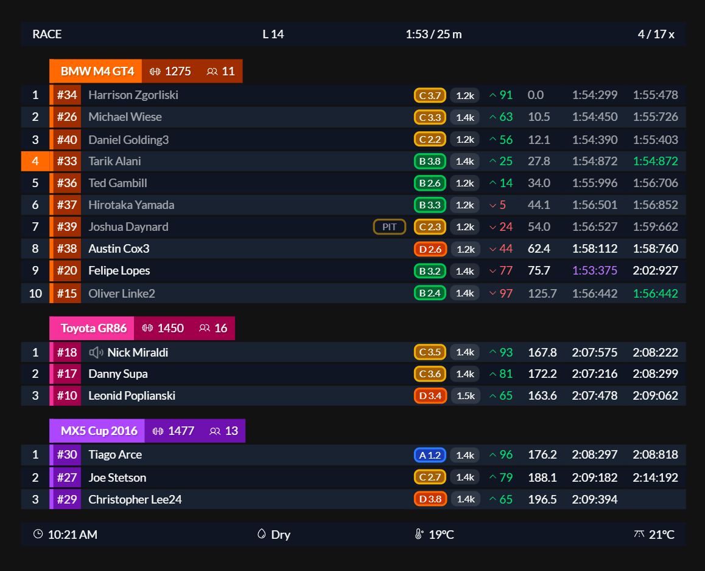
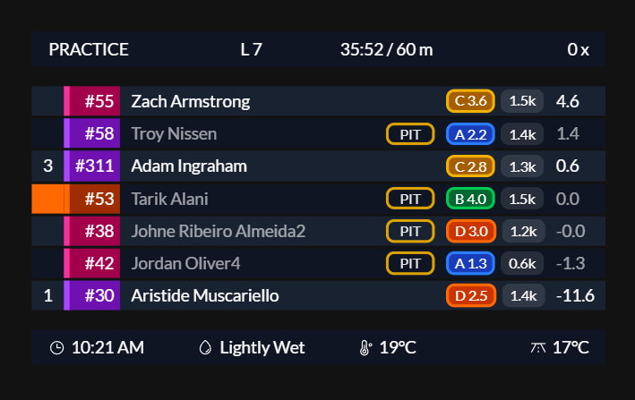

# iRacing Dashies

Welcome to the iRacing Dashies project! This repository contains the code and documentation for building iRacing overlays. 

This is an open-source project that aims to provide a platform to build overlays and utilities for iRacing using React and Electron. 

This is built with the intention of being easily approachable by developers who are familiar with web development as well as not needing to have a deep understanding of the iRacing SDK, C++, or even needing to run iRacing at all.

This project is still in the early stages of development, so there may be bugs and many missing features. If you are interested in contributing please reach out and we can discuss how we can collaborate.

## Try it out

You can try it out by downloading the latest release from the [releases page](https://github.com/tariknz/irdashies/releases).

Install the .exe and run it. The application will automatically update when a new version is available.

## Table of Contents

- [Introduction](#introduction)
- [Prerequisites](#prerequisites)
- [Installation](#installation)
- [Usage](#usage)
- [Folder Structure](#folder-structure)
- [Storybook](#storybook)
- [Package (create .exe)](#package-create-exe)
- [Testing](#testing)
- [Linting](#linting)
- [Contributing](#contributing)
- [License](#license)

## Introduction

This project is built with React and Electron and uses the iRacing SDK to retrieve data from the iRacing live telemetry memory-map.

## Prerequisites

- Node.js (v20 or higher)
- npm (comes with Node.js)
- Windows build tools if you are on Windows
  - `npm install -g windows-build-tools` from an elevated PowerShell (run as Administrator). 
  - See [this guide](https://github.com/Microsoft/nodejs-guidelines/blob/master/windows-environment.md#compiling-native-addon-modules) for more details and alternative methods.
- iRacing installed on your machine (Windows only)

> Note: Developing on MacOS is fully supported and does not require iRacing or any additional tools to be installed as it uses a mocked SDK.

## Installation (for development)

To install IRDashies, follow these steps:

1. Clone the repository
2. Navigate to the project directory
3. Install the required dependencies:
  ```bash
  npm install
  ```
4. Run the application:
  ```bash
  npm start
  ```
5. Optionally, you can run the storybook to view the components in isolation:
  ```bash
  npm run storybook
  ```

## Usage (for development)

To start using IRDashies, run the following command:
```bash
npm start
```
This will start the application.

Look for the application in your app tray.

> You will need to have Node.js installed on your machine to run the application. You can download it from [here](https://nodejs.org/).

> On macOS you will see mocked data from a sample session. To connect to iRacing, you will need to run the application on Windows.

While developing its recommended you run storybook as it gives you a quick way to iterate your changes:

```bash
npm run storybook
```

## Folder Structure

The project is structured as follows:

```
irdashies/
  ├── src/
  │   ├── app/
  │   ├── frontend/
  │   ├── types/
```

- `src/app/` contains the main Electron application code.
- `src/app/irsdk/` contains the iRacing SDK code including the native C++ bindings.
- `src/frontend/` contains the React components for the overlays.
- `src/types/` contains TypeScript type definitions shared between the frontend and backend (e.g. telemetry types).

> Note: Frontend components should NOT import anything from ./app as these are Electron-specific modules. Any communication should be done via IPC and types exposed via the types folder.

## Storybook

To view the components in Storybook, run the following command:
```bash
npm run storybook
```

This allows you to easily develop, test, and visualise the widgets/overlays in isolation.

## Package (create .exe)

To package the application and create the .exe, run the following command:
```bash
npm run package
```

To create the .exe and the installer run the following:

```bash
npm run make
```

## Testing

To run the tests, run the following command:
```bash
npm run test
```

## Linting

To run the linting, run the following command:
```bash
npm run lint
```

> Ensure you have ESLint extension installed if using VS Code and have enabled "Use Flat Config" in your settings.

## Developing on Mac

As you may know, the iRacing SDK is only available on Windows. To develop on Mac OS, there is a mock SDK that is loaded which generates some dummy data for you to work with. This is useful for developing the UI components and widgets.

## General Settings

Adjust Overlay Text Size
Change Overlay Theme (Blue/Black)
Change Tempurature Units (C/F)


## Available overlays

### Input trace

Displays the throttle, clutch, and brake input traces, as well as the current gear and speed.


### Standings

Displays standings information for the current session.



### Relative

Displays drive relative delta information for the current session.



### Track Map

Displays a track map with the current position of the cars on track and the track layout with the turn numbers / names.

> This is very much a work in progress and is currently missing a few tracks and some track directions are not correct currently.

> This is hidden by default until its ready for GA. To enable this, you will need to go into the settings and set the track map to be enabled. Save and restart the application.


### Weather

Displays the weather information for the current session.


## Contributing

We welcome contributions to the IRDashies project! If you have any ideas, suggestions, or bug reports, please open an issue or submit a pull request.

Join our discord here: https://discord.gg/YMAqduF2Ft

## License

This project is licensed under the MIT License. See the [LICENSE](LICENSE) file for more details.